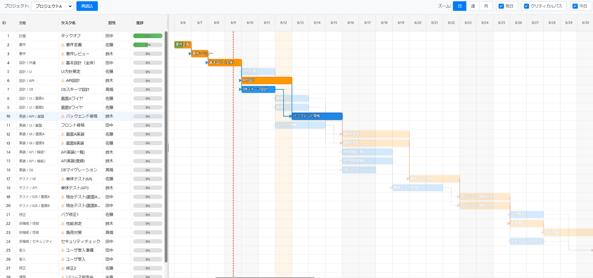

# WBS + ガントチャート ビューア



Excelファイルからプロジェクトデータを読み込み、WBS（Work Breakdown Structure）とガントチャートを表示するWebアプリケーションです。

## 主な機能

### 📊 データ管理
- **Excel読み込み**: `.xlsx`ファイルを「ファイルを開く」ボタンから選択して読み込み（シート=複数プロジェクト）
- **プロジェクト切り替え**: シートごとに管理された複数プロジェクトの切り替え
- **祝日対応**: 祝日シートから祝日データを読み込み、カレンダー表示に反映(事前に登録する必要があります。)

### 📈 スケジューリング
- **CPM（Critical Path Method）**: 自動的にクリティカルパスを計算
- **依存関係管理**: タスク間の前後関係を矢印で可視化
- **進捗管理**: 各タスクの進捗率を視覚的に表示

### 🎨 表示機能
- **WBSツリー**: タスク一覧を階層的に表示（ID、分類、タスク名、担当、進捗）
- **ガントチャート**: タスクの期間をバーで表示、依存関係を矢印で接続
- **ズーム機能**: 日/週/月の3段階でズーム可能
- **スクロール同期**: WBSとガントチャートの縦スクロールを同期
- **ハイライト機能**: 
  - クリティカルパスをオレンジ色で強調表示
  - ホバー時に関連タスクと前工程を青色で強調
- **カレンダー表示**: 週末と祝日を背景色で区別
- **今日ライン**: 現在日を赤い破線で表示（初期表示は `config.ui.showTodayLine` で制御、既定はON）

## セットアップ

### 必要環境
- Node.js 18以上
- npm または yarn
- Python 3.8以上（Excelテンプレート生成用）

### インストール
```bash
npm install
```

### Excelテンプレートの生成（初回のみ）
```bash
# ディレクトリ移動
cd scripts
# venvを作成
python -m venv .venv
# venvをactivate
source .venv/bin/activate
# Pythonの依存パッケージをインストール
pip install -r requirements.txt

# Excelテンプレートを生成（任意）
python generate_excel_template.py

# 生成されたサンプルファイルを任意の場所に保存（起動後に「ファイルを開く」から選択）
```

このスクリプトは、`scripts/data/templates/csv/`内のCSVファイルから、
サンプルデータを含むExcelファイルを自動生成します。

### 開発サーバーの起動
```bash
npm run dev
```
ブラウザで http://localhost:5173 を開く

### ビルド
```bash
npm run build
```
成果物は `dist/` ディレクトリに出力されます

## Excelファイルの準備

### ファイル配置/選択
アプリ起動後、上部の「ファイルを開く」ボタンから任意の`.xlsx`ファイルを選択してください（配置場所は自由）。
※ 起動時に自動読み込みは行いません。

### シート構成
- **プロジェクトシート**: 各シートが1つのプロジェクトを表します
- **祝日シート**: シート名を「祝日」または「Holidays」にしてください

### プロジェクトシートの列定義

| 列名 | 必須 | 形式 | 説明 | 例 |
|---|---|---|---|---|
| ID | ✓ | 整数 | タスクID（シート内で一意） | 1 |
| 分類1 | - | 文字列 | 大分類 | 設計 |
| 分類2 | - | 文字列 | 中分類 | UI |
| 分類3 | - | 文字列 | 小分類 | 画面A |
| タスク名 | ✓ | 文字列 | タスクの名称 | 設計レビュー |
| 詳細 | - | 文字列 | タスクの詳細説明 | 要件確認と資料精査 |
| 備考 | - | 文字列 | 補足情報 | 外部調整あり |
| 開始日 | - | 日付 | YYYY/M/D形式 | 2025/8/1 |
| 終了日 | - | 日付 | YYYY/M/D形式 | 2025/8/5 |
| 工数（人日） | - | 数値 | 作業日数 | 3 |
| 前工程 | - | 文字列 | 依存するタスクID（カンマ区切り） | 10,12 |
| 担当 | - | 文字列 | 担当者名 | 田中 |
| 進捗（%） | - | 数値 | 0-100の進捗率 | 50 |

### 祝日シートの列定義

| 列名 | 必須 | 形式 | 説明 | 例 |
|---|---|---|---|---|
| 日付 | ✓ | 日付 | YYYY/M/D形式 | 2025/1/1 |
| 名称 | - | 文字列 | 祝日名 | 元日 |

## 設定ファイル

`public/config/app.config.json` で初期設定を変更できます：

```json
{
  "holidaySheetNames": ["祝日", "Holidays"],
  "ui": {
    "defaultZoom": "day",
    "showHolidays": true,
    "showCriticalPath": true,
    "showTodayLine": true
  },
  "rangeBeforeDays": 7,
  "rangeAfterDays": 45
}
```

## 使い方

1. **ファイルを開く**: 上部の「ファイルを開く」ボタンから `.xlsx` を選択
2. **プロジェクト選択**: シートをドロップダウンで切替
3. **ズーム調整**: 日/週/月ボタンで時間軸の表示範囲を調整
4. **表示設定**: 
   - 祝日: 週末と祝日の背景表示ON/OFF
   - クリティカルパス: クリティカルタスクの強調表示ON/OFF
   - 今日: 今日ラインの表示ON/OFF（初期値は `config.ui.showTodayLine`）
5. **タスク詳細**: タスク行またはガントバーをクリックで詳細情報を表示
6. **ファイル再選択**: 別のファイルを選ぶと再読み込みされます. すでに開いているExcelの修正を反映させたい場合もこの機能を使用してください.

## クリティカルパスの判定ロジック（概要）

本アプリのCPMはFS（Finish-to-Start）・ラグ0日を前提とした最小実装です（祝日・週末は表示のみで計算には未反映）。

- **期間補完**:
  - `開始/終了` のどちらかが欠ける場合、`開始+工数（人日）` もしくは `終了-工数（人日）` から補完
  - 両方欠ける場合は「今日」を起点に工数で補完（工数未定は1日相当）
- **前進計算（Early）**:
  - 先行タスクが無い場合: `ES=開始, EF=終了`
  - ある場合: すべての先行タスクの `EF` の最大値の翌日を `ES`、所要日数を用いて `EF` を算出
- **後退計算（Late）**:
  - 後続タスクが無い場合: プロジェクトの最終 `EF` を `LF` とし、所要日数ぶん戻して `LS`
  - ある場合: 後続タスクの `LS` の最小値の前日を `LF`、所要日数ぶん戻して `LS`
- **余裕（Total Float）**:
  - `Total Float = LS - ES`（日数差）。`Total Float <= 0` をクリティカルタスクと判定
- **クリティカル辺**:
  - クリティカル同士の依存で、かつ `successor.ES = predecessor.EF + 1日` を満たす辺をクリティカル辺として強調

注: 祝日・週末の着色は表示のみで、スケジュール計算は暦日ベース（営業日考慮は将来拡張）。

## 技術スタック

- **フレームワーク**: React 18 + TypeScript
- **ビルドツール**: Vite
- **状態管理**: Zustand
- **Excel処理**: SheetJS (xlsx)
- **日付処理**: Day.js
- **スタイリング**: CSS Modules

## プロジェクト構成

```
src/
├── app/              # メインアプリケーション
├── components/       # UIコンポーネント
│   ├── GanttChart/   # ガントチャート
│   ├── WbsTree/      # WBSツリー
│   ├── Toolbar/      # ツールバー
│   ├── TaskCard/     # タスク詳細カード
│   └── Toast/        # 通知
├── features/         # ビジネスロジック
│   ├── projects/     # プロジェクト管理
│   ├── tasks/        # タスク処理
│   └── schedule/     # スケジュール計算
├── models/           # データモデル定義
├── services/         # 外部サービス連携
│   ├── config/       # 設定管理
│   ├── excel/        # Excel読み込み
│   └── storage/      # ローカルストレージ
├── store/            # 状態管理
└── utils/            # ユーティリティ関数
```

## ライセンス

MIT